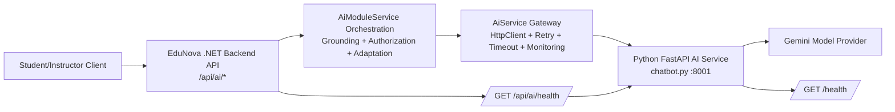
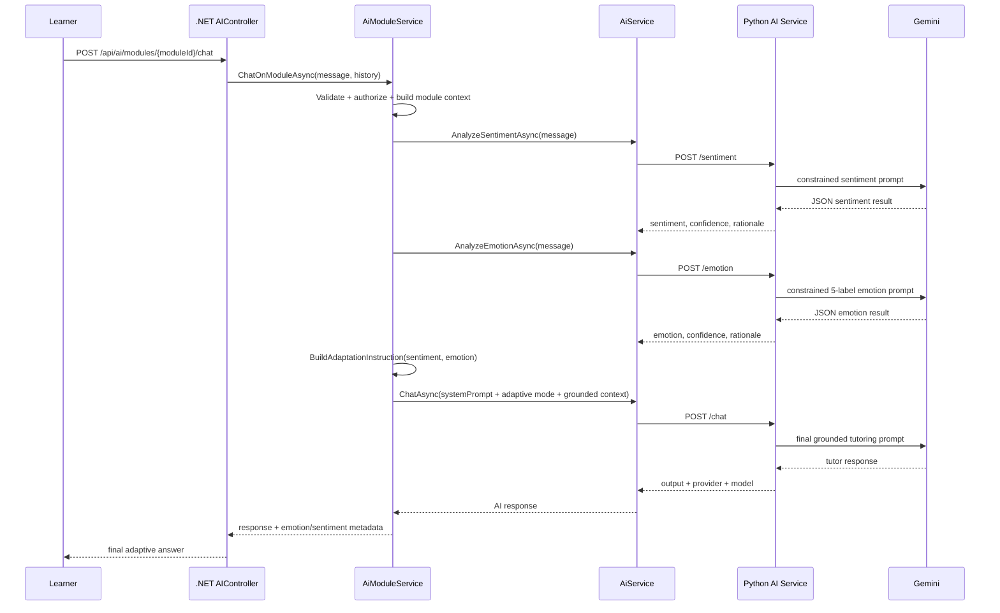

# EduNova Backend AI Final Technical Report

## Scope

This report documents the current AI implementation in EduNova backend, with direct alignment to the repository implementation and near-term roadmap.

Primary implementation references:

- [Application/Services/AiModuleService.cs](Application/Services/AiModuleService.cs)
- [Application/Services/AiService.cs](Application/Services/AiService.cs)
- [Application/Services/aiService/chatbot.py](Application/Services/aiService/chatbot.py)
- [Backend/Controllers/AIController.cs](Backend/Controllers/AIController.cs)
- [Backend/Program.cs](Backend/Program.cs)
- [Backend/appsettings.json](Backend/appsettings.json)
- [Application/Services/AiMonitoringService.cs](Application/Services/AiMonitoringService.cs)
- [Application/Services/AiConversationMemoryService.cs](Application/Services/AiConversationMemoryService.cs)

## 1) AI Integration Layers

EduNova uses a layered hybrid architecture:

1. Presentation/API Layer (.NET): HTTP endpoints exposed under `/api/ai/*` and `/api/ai/modules/*` in [Backend/Controllers/AIController.cs](Backend/Controllers/AIController.cs).
2. Orchestration Layer (.NET): module-aware orchestration, grounding, authorization checks, sentiment/emotion-driven adaptation in [Application/Services/AiModuleService.cs](Application/Services/AiModuleService.cs).
3. Gateway/Transport Layer (.NET): resilient HTTP client with timeout, retry, monitoring, and fallback normalization in [Application/Services/AiService.cs](Application/Services/AiService.cs).
4. AI Inference Layer (Python FastAPI): prompt engineering and inference endpoints (`/chat`, `/summary`, `/quiz`, `/sentiment`, `/emotion`) in [Application/Services/aiService/chatbot.py](Application/Services/aiService/chatbot.py).
5. External Model Provider Layer: Gemini provider (or fake mode for deterministic local tests), configured in [Application/Services/aiService/chatbot.py](Application/Services/aiService/chatbot.py).

This separation keeps provider logic isolated while preserving stable frontend/backend contracts.

## 2) Course Management and Orchestration via AiModuleService.cs

`AiModuleService` is the core educational orchestration engine:

1. Authorization and course ownership/enrollment gating:
   - Student must be enrolled in module course.
   - Instructor must own module course.
   - Implemented in `GetAuthorizedModuleAsync` in [Application/Services/AiModuleService.cs](Application/Services/AiModuleService.cs).
2. Module context construction:
   - Builds context from module title, description, and content sections.
   - Trims oversized context and validates minimum pedagogical content.
3. AI operation orchestration:
   - Summary generation.
   - Quiz generation.
   - Grounded tutoring chat by module.
4. Learning adaptation:
   - Calls sentiment and emotion classifiers for each incoming module chat turn.
   - Dynamically modifies tutor behavior via adaptive instruction injection.
5. Reliability behavior:
   - Logs latency and failures.
   - Returns safe fallback tutoring responses when downstream AI is unavailable.

## 3) chatbot.py Inference Engine

The Python service in [Application/Services/aiService/chatbot.py](Application/Services/aiService/chatbot.py) provides:

1. FastAPI microservice endpoints:
   - `GET /health`
   - `POST /chat`
   - `POST /summary`
   - `POST /quiz`
   - `POST /sentiment`
   - `POST /emotion`
2. Strict request validation (Pydantic constraints: message length, language code size, structured payloads).
3. Prompt-building strategies specialized by task:
   - Grounded tutoring chat prompt.
   - Short/detailed summary prompt.
   - Difficulty-aware quiz prompt.
   - Structured JSON classifier prompts for sentiment/emotion.
4. Multi-mode inference:
   - Real mode: Gemini API calls.
   - Fake mode: deterministic responses for testing and CI-like local flows.
5. Safety and robustness:
   - Safety settings for harmful categories.
   - Output extraction/parsing fallback.
   - Rule-based backup classifiers when parsing/provider output is invalid.

## 4) Microservice Communication Protocols and Port Management (Stateless Handling)

Communication model:

1. Protocol:
   - REST over HTTP JSON from backend to AI microservice.
   - .NET `HttpClient` serialization/deserialization in [Application/Services/AiService.cs](Application/Services/AiService.cs).
2. Service discovery and porting:
   - Base URL configured as `AiService:BaseUrl` in [Backend/appsettings.json](Backend/appsettings.json).
   - Default local AI service endpoint is `http://localhost:8001`.
   - Python service startup defaults to port `8001` in [Application/Services/aiService/chatbot.py](Application/Services/aiService/chatbot.py).
3. Timeout profile per operation:
   - Chat, summary, quiz, health each have dedicated timeout controls in [Application/Configuration/AiServiceSettings.cs](Application/Configuration/AiServiceSettings.cs).
4. Retry profile:
   - Exponential backoff retries (Polly) configured during `AddHttpClient` registration in [Backend/Program.cs](Backend/Program.cs).
5. Stateless request handling:
   - Each AI call transmits all required payload context (message/history/context/language) without server session dependency on Python side.
   - Optional conversation continuity is handled in backend memory service (TTL-bound) and merged into outbound request payload; downstream Python still processes per-request statelessly.

## 5) High Availability and Reliability via Dedicated AI Health Endpoints

Reliability controls are implemented at multiple points:

1. Dedicated health endpoint at inference service:
   - `GET /health` in [Application/Services/aiService/chatbot.py](Application/Services/aiService/chatbot.py).
2. Backend health proxy endpoint:
   - `GET /api/ai/health` in [Backend/Controllers/AIController.cs](Backend/Controllers/AIController.cs).
   - Returns `200` when AI microservice is healthy and `503` otherwise.
3. AI call resilience:
   - Retry for transient errors.
   - Endpoint-specific timeouts.
   - Friendly error mapping and fallback behavior in [Application/Services/AiService.cs](Application/Services/AiService.cs).
4. Monitoring and SLO visibility:
   - Per-endpoint stats (error rate, P95/P99 latency, RPM) in [Application/Services/AiMonitoringService.cs](Application/Services/AiMonitoringService.cs).
   - Exposed via `GET /api/ai/monitoring` for instructors in [Backend/Controllers/AIController.cs](Backend/Controllers/AIController.cs).

These controls support near-continuous operation by degrading gracefully instead of hard failing student workflows.

## 6) Methodology for POST /api/ai/emotion

Methodology flow:

1. Client sends `message`, `language`, and optional `moduleId` to backend endpoint `POST /api/ai/emotion` in [Backend/Controllers/AIController.cs](Backend/Controllers/AIController.cs).
2. Backend forwards to Python `/emotion` through `AiService.AnalyzeEmotionAsync` in [Application/Services/AiService.cs](Application/Services/AiService.cs).
3. Python builds constrained classifier prompt with exactly allowed labels in [Application/Services/aiService/chatbot.py](Application/Services/aiService/chatbot.py).
4. In real mode:
   - Calls Gemini.
   - Attempts strict JSON parse.
   - If parse fails, attempts regex JSON extraction.
5. If output remains invalid or runtime fails:
   - Falls back to deterministic rule-based textual heuristics.
6. Backend validates returned label against permitted set and normalizes confidence to [0, 1] range before responding.

## 7) Classification Mapping to 5 Constrained Labels

Emotion output is constrained to exactly five labels:

1. `confused`
2. `frustrated`
3. `engaged`
4. `confident`
5. `neutral`

Enforcement points:

1. Prompt-level constraint in `_build_emotion_prompt` in [Application/Services/aiService/chatbot.py](Application/Services/aiService/chatbot.py).
2. Python post-parse normalization (`if label not in {...} => neutral`) in [Application/Services/aiService/chatbot.py](Application/Services/aiService/chatbot.py).
3. Backend guardrail `IsValidEmotion` and fallback normalization in [Application/Services/AiService.cs](Application/Services/AiService.cs).

## 8) Sentiment/Emotion Metadata Capture and Dynamic Prompt Injection

Adaptive tutoring flow in module chat:

1. User question enters `ChatOnModuleAsync` in [Application/Services/AiModuleService.cs](Application/Services/AiModuleService.cs).
2. Backend requests:
   - Sentiment classification via `AnalyzeSentimentAsync`.
   - Emotion classification via `AnalyzeEmotionAsync`.
3. `BuildAdaptationInstruction(sentiment, emotion)` maps classifier output to tutoring strategy:
   - Confused/frustrated/negative -> simplify, step-by-step, example, comprehension check.
   - Engaged/confident/positive -> add optional advanced depth and follow-up concept.
4. Adaptation instruction is appended into the system prompt before calling chat inference.
5. Final response metadata includes:
   - `Sentiment`
   - `Emotion`
   - `AdaptationApplied`

This creates a closed-loop adaptive tutoring behavior while preserving strict module grounding rules.

## 9) Limitations of Current Model (Text-Only Emotion Detection)

Current limitations to acknowledge:

1. Text-only signal: no voice prosody, facial expression, pause dynamics, or behavioral context in the classifier pipeline.
2. Short utterance ambiguity: very short inputs like "OK", "fine", or "..." provide minimal semantic evidence and are likely to default to neutral or low-confidence inference.
3. Cultural/linguistic variance: emotional cues differ by language and phrasing style; sparse utterances amplify this issue.
4. Single-turn bias: immediate turn classification may miss broader trend without longitudinal aggregation.
5. Rule fallback simplification: heuristic fallback ensures robustness but can be less nuanced than model inference.

Mitigation currently in place:

1. Confidence normalization and label constraints.
2. Neutral fallback for unknown/invalid labels.
3. Adaptive mode activation only when strong enough cues exist.

## 10) Personalized Study Plans Roadmap: Knowledge Graph Integration

Planned enhancement:

1. Build learner-specific knowledge graphs linking:
   - Concepts mastered.
   - Concept dependencies/prerequisites.
   - Misconception hotspots.
   - Recommended next module sequence.
2. Use graph traversal and mastery scores to generate long-horizon personalized pathways.
3. Inject graph-derived context into AI prompts for personalized tutoring, not only per-module grounding.

Expected impact:

1. Better continuity between modules.
2. Faster remediation of prerequisite gaps.
3. More explainable pathway recommendations for students and professors.

## 11) Predictive Analytics for Dropout Prevention (Planned)

Proposed telemetry aggregation pipeline:

1. Behavioral signals:
   - Login frequency and recency.
   - Session duration/time-on-platform.
   - Module completion progression.
2. Affective signals:
   - Emotional trend trajectories over time.
   - Sentiment drift toward persistent frustration/confusion.
3. Engagement signals:
   - Quiz attempts and score trends.
   - Tutor-chat dependence spikes.
4. Risk scoring:
   - Compute dropout risk bands (low/medium/high) from multivariate trends.
5. Intervention layer:
   - Alert professors early.
   - Recommend tailored interventions (office hours, remediation resources, pacing adjustments).

This transitions AI from reactive tutoring to proactive retention support.

## 12) Visuals

### 12.1 Architecture Diagram



### 12.2 Data Flow Diagram (Emotion-Aware Prompt Path)



## 13) Pseudo-Code Snippet: Emotion Label Injection into Prompt Context

```text
function ChatOnModule(moduleId, userId, role, request):
    module = GetAuthorizedModule(moduleId, userId, role)
    context = BuildModuleContext(module)

    sentiment = AiService.AnalyzeSentiment({ message: request.message, language: request.language })
    emotion   = AiService.AnalyzeEmotion({ message: request.message, language: request.language })

    adaptInstruction = BuildAdaptationInstruction(sentiment.label, emotion.label)

    systemPrompt = BuildGroundedChatSystemPrompt(module, request.language)
    if adaptInstruction is not empty:
        systemPrompt += "\n\n## Adaptive response mode:\n" + adaptInstruction

    userPrompt = BuildGroundedChatUserMessage(context, request.message)

    aiResponse = AiService.Chat({
        message: userPrompt,
        context: systemPrompt,
        history: request.history,
        strict_grounded: true
    })

    aiResponse.sentiment = sentiment.label
    aiResponse.emotion = emotion.label
    aiResponse.adaptationApplied = (adaptInstruction != "")
    return aiResponse
```

## Conclusion

EduNova backend already implements a robust foundation for AI-assisted learning through a clean .NET-to-Python microservice architecture, constrained affective classification, grounded adaptive prompting, and availability-focused fallback/monitoring controls. The next maturity step is longitudinal intelligence: knowledge graph personalization and dropout-risk analytics that transform per-request tutoring into sustained student-success orchestration.
